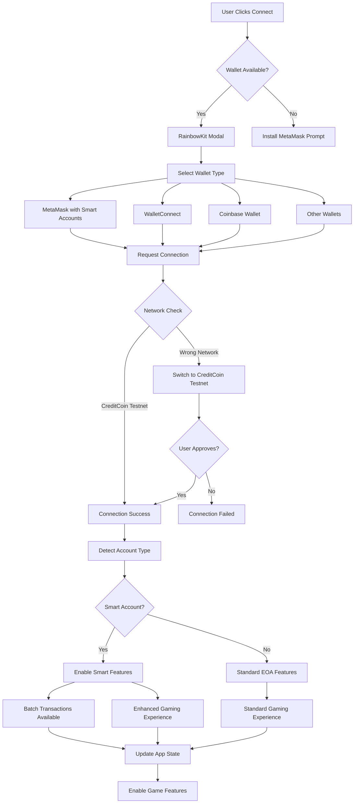
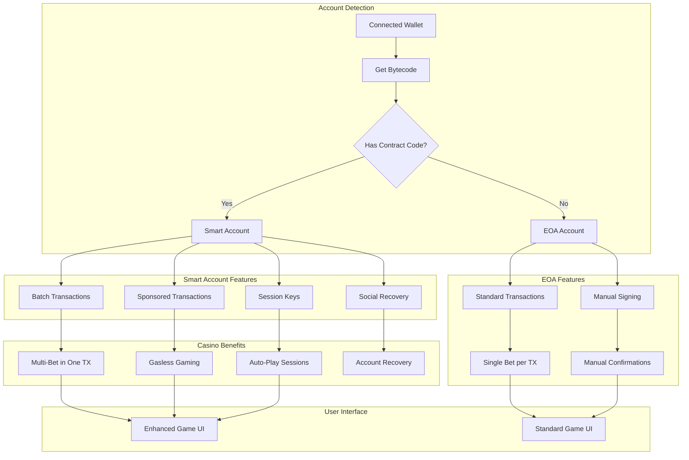
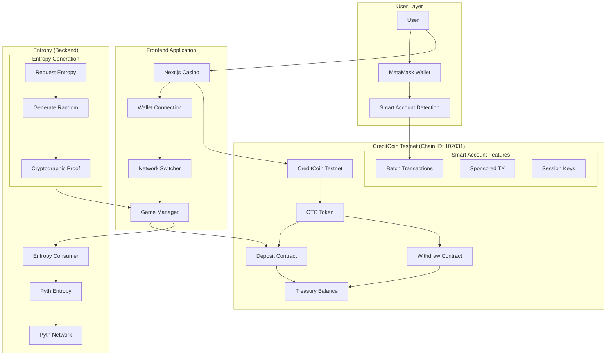
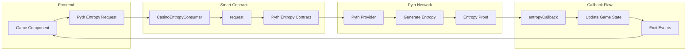
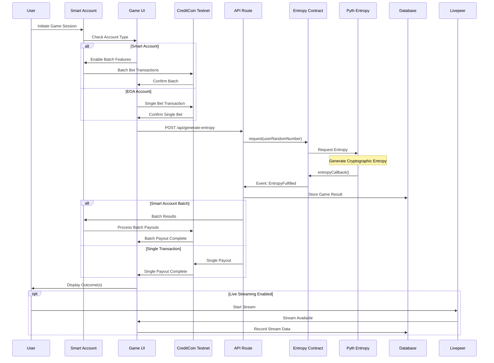
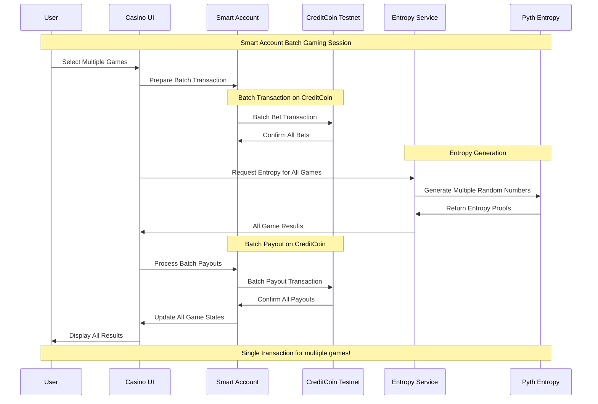

# 🎮 APT-Casino: A Fully On-Chain, Provably-Fair Casino

**Built for CreditCoin - Gaming track:** games and gaming infrastructure that leverage Creditcoin for in-game economies, asset ownership, and marketplaces (#In-Game crypto #Social platforms).

| | |
|---|---|
| **Track** | Gaming |
| **Live app** | [apt-casino-seven.vercel.app](https://apt-casino-seven.vercel.app/) |
| **Pitch deck** | [APT Casino Creditcoin (Figma)](https://www.figma.com/deck/PmjEyl0vtf53QuJj43Pml3/APT-Casino-Creditcoin?node-id=1-1812&t=EiOlhg72qkKFDcu9-1) |
| **GitHub** | [Amaan02/APT-Casino](https://github.com/Amaan02/APT-Casino) |
| **Demo video** | [Watch on YouTube](https://youtu.be/IjvNzgjD5tg) |

### Important CreditCoin Testnet Addresses

| Name | Address | Explorer |
|------|---------|----------|
| **Treasury Wallet** | `0x71197e7a1CA5A2cb2AD82432B924F69B1E3dB123` | [Transactions](https://creditcoin-testnet.blockscout.com/address/0x71197e7a1CA5A2cb2AD82432B924F69B1E3dB123?tab=txs) |
| **Logger Contract** | `0x0F95D1c2c4E18A17A0a0A4E3c27D5e581b58ABBE` | [Logs](https://creditcoin-testnet.blockscout.com/address/0x0F95D1c2c4E18A17A0a0A4E3c27D5e581b58ABBE?tab=logs) |
| **NFT Attestation Contract** | `0x0B61D7b981062b0dd5D95F8B6455Eca0a2C1d8C7` | [Logs](https://creditcoin-testnet.blockscout.com/address/0x0B61D7b981062b0dd5D95F8B6455Eca0a2C1d8C7?tab=logs) |

---

A couple of days back, I was was on etherscan exploring some transactions and saw an advertisement of https://stake.com/ which was giving 200% bonus on first deposit, I deposited 120 USDT into stake.com they gave 360 USDT as total balance in their controlled custodial wallet and when I started playing casino games I was shocked to see that I was only able to play with $1 per game and was unable to increase the betting amount beyond $1 and when I tried to explore and play other games on the platform the issue was persisting, I reached the customer support and got to know that this platform has cheated me under the name of wager limits as I was using the bonus scheme of 200%.

When I asked the customer support for refund they showed a mathematical equation which says if refund then I have to play $12,300 worth of gameplay and this was a big shock for me. Thereby, In the hope of getting the deposited money back, I played the different games of stake.com like roulette, mines, spin wheel, etc, the entire night and lost all the money and time.

I was very annoyed of that's how Apt-Casino was born, gamblefi all in one platform where new web3 users can play games, perform gambling but have a safe, secure, transparent environment that does not scam any of their users. Also, I wanted to address common issues in traditional gambling platforms.

## 🎯 The Problem

The traditional online gambling industry suffers from several issues:

- **Unfair Game Outcomes**: 99% of platforms manipulate game results, leading to unfair play
- **High Fees**: Exorbitant charges for deposits, withdrawals, and gameplay
- **Restrictive Withdrawal Policies**: Conditions that prevent users from accessing their funds
- **Misleading Bonus Schemes**: Trapping users with unrealistic wagering requirements
- **Lack of True Asset Ownership**: Centralized control over user funds
- **User Adoption Barriers**: Complexity of using wallets creates friction for web2 users
- **No Social Layer**: Lack of live streaming, community chat, and collaborative experiences

## 💡 Our Solution

APT Casino addresses these problems by offering:
- **Provably Fair Gaming**: All game outcomes are verifiably fair on-chain, not only by its developers but can be verified by the gambler themselves.


- **Multiple Games**: Wheel, Roulette, Plinko, and Mines with verifiable outcomes
- **MetaMask Smart Accounts**: Enhanced wallet experience with batch transactions
- **Flexible Withdrawal**: Unrestricted access to funds
- **Transparent Bonuses**: Clear terms without hidden traps
- **True Asset Ownership**: Decentralized asset management
- **Live Streaming Integration**: Built with Livepeer, enabling real-time game streams and tournaments
- **On-Chain Chat**: Supabase + Socket.IO with wallet-signed messages for verifiable player communication
- **Gasless Gaming Experience**: Treasury-sponsored transactions for seamless web2-like experience

## 🌟 Key Features

### 1. Smart Account Integration

- **Batch Transactions**: Multiple bets in one transaction
- **Delegated Gaming**: Authorise AI agent strategies to play on your behalf
- **Lower Gas Costs**: Optimized for frequent players
- **Enhanced Security**: Smart contract-based accounts

### 2. Provably Fair Gaming


- **Pyth Entropy**: Cryptographically secure randomness
- **On-Chain Verification**: All game outcomes verifiable
- **Transparent Mechanics**: Open-source game logic

### 3. CreditCoin Architecture

- **Gaming Network**: CreditCoin Testnet (Chain ID: 102031) — deposits, withdrawals, game logging
- **Entropy**: Pyth Entropy for provably fair randomness (backend)

### 4. Game Selection

- **Roulette**: European roulette with Smart Account batch betting
- **Mines**: Strategic mine-sweeping with delegated pattern betting
- **Plinko**: Physics-based ball drop with auto-betting features
- **Wheel**: Classic spinning wheel with multiple risk levels

### 5. Social Features

- **Live Streaming**: Integrated with Livepeer for real-time game streams and tournaments
- **On-Chain Chat**: Real-time communication with wallet-signed messages
- **Player Profiles**: NFT-based profiles with gaming history and achievements
- **Community Events**: Tournaments and collaborative gaming experiences

### 6. Web2 User Experience

- **Gasless Transactions**: Treasury-sponsored transactions eliminate gas fees
- **Seamless Onboarding**: Simplified wallet experience for web2 users
- **Familiar Interface**: Web2-like experience with web3 benefits

### 7. In-Game NFTs & Asset Ownership

APT Casino uses **Creditcoin for in-game asset ownership** via an on-chain NFT collection:

- **ERC-721 NFTs**: A unique NFT is minted on CreditCoin Testnet for each completed game (Roulette, Mines, Wheel, Plinko).
- **Player-owned records**: Every game result is tied to a verifiable, tradeable NFT — true asset ownership and proof of play.
- **On-chain storage**: NFT metadata and mint records are stored on the CreditCoin Game Logger contract; no separate database required.
- **Transparent history**: Players can view their NFT collection, share game proofs, and use them in a player-driven economy.

This aligns with the Buidl CTC Gaming track: **in-game crypto** and **asset ownership** on Creditcoin. See [NFT On-Chain Storage](./docs/nft-on-chain-storage.md) for implementation details.

## 🚀 Getting Started

1. **Connect Wallet**: Connect your MetaMask wallet to CreditCoin Testnet
2. **Get Tokens**: Get CTC from the CreditCoin testnet faucet
3. **Deposit**: Deposit CTC to your APT-Casino wallet balance
4. **Play**: Start playing provably fair games without any txn confirmation requirement!

### Network Configuration

#### CreditCoin Testnet (Primary Network)
Add CreditCoin Testnet to MetaMask:
- **Network Name**: CreditCoin Testnet
- **RPC URL**: `https://rpc.cc3-testnet.creditcoin.network`
- **Chain ID**: `102031`
- **Currency Symbol**: `CTC`
- **Block Explorer**: `https://creditcoin-testnet.blockscout.com`

**Note:** Users connect only to CreditCoin Testnet. Entropy/randomness is handled in the background.

### Quick Setup

```bash
# Clone the repository
git clone https://github.com/Amaan02/APT-Casino.git
cd APT-Casino

# Install dependencies
npm install

# Set up environment variables
# Copy .env.example to .env and fill in your values (or copy from "Environment Variables" below)
# ⚠️ IMPORTANT: Never commit your .env file to version control!

# Run development server
npm run dev
```

Visit `http://localhost:3000` to see the application.

**Note:** Make sure to configure all required environment variables in your `.env` file before running the application. See the [Environment Variables](#environment-variables) section for the complete configuration.

## 🔷 Smart Account Features

APT Casino leverages MetaMask Smart Accounts for an enhanced gaming experience:

### Delegation Benefits:
- **Auto-Betting Strategies**: Delegate betting permissions to strategy contracts
- **Batch Gaming Sessions**: Play multiple games in a single transaction
- **Session-Based Gaming**: Set time-limited permissions for continuous play
- **Gasless Gaming**: Sponsored transactions for smoother experience

### Usage:
```javascript
// Create a delegation for auto-betting
const createAutoBetDelegation = async (maxBet, timeLimit, gameTypes) => {
  return delegationRegistry.createDelegation({
    delegatee: strategyContract,
    constraints: {
      maxAmount: maxBet,
      validUntil: timeLimit,
      allowedGames: gameTypes
    }
  });
};

// Execute batch bets through delegation
const executeBatchBets = async (bets) => {
  return delegationRegistry.executeDelegatedTransactions({
    delegationId,
    transactions: bets.map(bet => ({
      to: bet.gameContract,
      data: bet.data,
      value: bet.amount
    }))
  });
};
```

## 🔗 Wallet Connection & Smart Account Flow



## 🔷 Smart Account Detection & Features



## 🌐 CreditCoin Architecture



## 🎲 Pyth Entropy Integration Architecture



## 🎮 Game Execution Flow (Smart Account Enhanced)



## 🔄 Smart Account Transaction Flow



## 🔮 Future Roadmap

- **Mainnet Launch**: Deploying on CreditCoin mainnet for real-world use
- **Additional Games**: Expanding the game selection
- **Enhanced DeFi Features**: Staking, farming, yield strategies
- **Developer Platform**: Allowing third-party game development
- **Advanced Social Features**: Enhanced live streaming and chat capabilities
- **ROI Share Links**: Shareable proof-links for withdrawals that render dynamic cards on social platforms
- **Expanded Smart Account Features**: More delegation options
- **Tournament System**: Competitive gaming with leaderboards and prizes

## 📋 Deployed Contract Addresses

### CreditCoin Testnet (Chain ID: 102031)
- **Treasury**: `0x71197e7a1CA5A2cb2AD82432B924F69B1E3dB123`
  - Handles deposits and withdrawals (wallet address)
- **CreditCoin Game Logger**: `0x0F95D1c2c4E18A17A0a0A4E3c27D5e581b58ABBE`
  - Logs all game results on-chain (with NFT tracking)
- **APT Casino NFT Contract**: `0x0B61D7b981062b0dd5D95F8B6455Eca0a2C1d8C7`
  - ERC-721 NFT collection for game records (CreditCoin Testnet)
  - One NFT minted per completed game; metadata and mint tx stored on-chain via Game Logger
  - Base URI: `https://aptcasino.com/nft/`

### Entropy (Backend)
- **Pyth Entropy Contract**: `0x549ebba8036ab746611b4ffa1423eb0a4df61440`
  - Official Pyth Network entropy contract for randomness
- **Pyth Entropy Provider**: `0x6CC14824Ea2918f5De5C2f75A9Da968ad4BD6344`
  - Provider address for entropy requests
- **Casino Entropy Consumer V1**: `0x3670108F005C480500d424424ecB09A2896b64e9`
- **Casino Entropy Consumer V2**: `0xF624e212434EFFD3943A1853a451cF172a99a1Cf`

### Network Configuration
- **Primary Network**: CreditCoin Testnet (deposits, withdrawals, game logging)
- **Entropy**: Pyth Entropy (backend)

## 🎮 Game Logger

All game results are permanently logged on CreditCoin Testnet:

### Features
- **Immutable Records**: All game outcomes stored on-chain
- **Verifiable History**: Transaction links for every game
- **CreditCoin-only**: Game logs on CreditCoin Testnet
- **Automatic Logging**: Non-blocking, fire-and-forget logging

### Smart Contract

```solidity
contract CreditCoinGameLogger {
  function logGameResult(
    uint8 gameType,
    uint256 betAmount,
    bytes memory resultData,
    uint256 payout,
    bytes32 entropyRequestId,
    string memory entropyTxHash
  ) external returns (bytes32 logId);
}
```

### Contract Address
- **CreditCoin Game Logger**: `0x0F95D1c2c4E18A17A0a0A4E3c27D5e581b58ABBE`

### Integration Example

```javascript
import { useCreditcoinGameLogger } from '@/hooks/useCreditCoinGameLogger';

const { logGame, getExplorerUrl } = useCreditcoinGameLogger();

// After game completes
const txHash = await logGame({
  gameType: 'ROULETTE',
  betAmount: '1000000000000000000',
  result: gameResult,
  payout: '2000000000000000000',
  entropyProof: entropyResult.entropyProof
});

console.log('View on explorer:', getExplorerUrl(txHash));
```

### Environment Variables

Create a `.env` file in the root directory with the following configuration (only required variables):

```env
# Supabase (real-time / optional features)
NEXT_PUBLIC_SUPABASE_ANON_KEY=your_supabase_anon_key_here
NEXT_PUBLIC_SUPABASE_URL=your_supabase_url_here

# WalletConnect
NEXT_PUBLIC_WALLETCONNECT_PROJECT_ID=your_walletconnect_project_id_here

# CreditCoin Testnet (primary network)
NEXT_PUBLIC_CREDITCOIN_TESTNET_RPC=https://rpc.cc3-testnet.creditcoin.network
NEXT_PUBLIC_CREDITCOIN_TESTNET_CHAIN_ID=102031
NEXT_PUBLIC_CREDITCOIN_TESTNET_EXPLORER=https://creditcoin-testnet.blockscout.com
NEXT_PUBLIC_CREDITCOIN_TESTNET_CURRENCY=CTC
CREDITCOIN_RPC_URL=https://rpc.cc3-testnet.creditcoin.network

# CreditCoin Treasury (deposits, withdrawals, game logging)
TREASURY_ADDRESS=0x71197e7a1CA5A2cb2AD82432B924F69B1E3dB123
TREASURY_PRIVATE_KEY=your_treasury_private_key_here
CREDITCOIN_TREASURY_ADDRESS=0x71197e7a1CA5A2cb2AD82432B924F69B1E3dB123
CREDITCOIN_TREASURY_PRIVATE_KEY=your_creditcoin_treasury_private_key_here
NEXT_PUBLIC_CREDITCOIN_TREASURY_ADDRESS=0x71197e7a1CA5A2cb2AD82432B924F69B1E3dB123

# CreditCoin Game Logger
NEXT_PUBLIC_CREDITCOIN_GAME_LOGGER_ADDRESS=0x0F95D1c2c4E18A17A0a0A4E3c27D5e581b58ABBE
CREDITCOIN_GAME_LOGGER_ADDRESS=0x0F95D1c2c4E18A17A0a0A4E3c27D5e581b58ABBE

# APT Casino NFT
NFT_CONTRACT_ADDRESS=0x0B61D7b981062b0dd5D95F8B6455Eca0a2C1d8C7
NEXT_PUBLIC_NFT_CONTRACT_ADDRESS=0x0B61D7b981062b0dd5D95F8B6455Eca0a2C1d8C7
NFT_BASE_URI=https://your-app-url.vercel.app/api/nft/
NEXT_PUBLIC_APP_URL=https://your-app-url.vercel.app
ENABLE_NFT_MINTING=true

# Pyth Entropy (Arbitrum Sepolia – randomness only)
NEXT_PUBLIC_ARBITRUM_SEPOLIA_RPC=https://sepolia-rollup.arbitrum.io/rpc
NEXT_PUBLIC_ARBITRUM_SEPOLIA_EXPLORER=https://sepolia.arbiscan.io
NEXT_PUBLIC_SEPOLIA_EXPLORER=https://sepolia.arbiscan.io
ARBITRUM_TREASURY_ADDRESS=0xb424d2369F07b925D1218B08e56700AF5928287b
ARBITRUM_TREASURY_PRIVATE_KEY=your_arbitrum_treasury_private_key_here
NEXT_PUBLIC_PYTH_ENTROPY_CONTRACT=0x549ebba8036ab746611b4ffa1423eb0a4df61440
NEXT_PUBLIC_PYTH_ENTROPY_PROVIDER=0x6CC14824Ea2918f5De5C2f75A9Da968ad4BD6344
NEXT_PUBLIC_CASINO_ENTROPY_NETWORK=arbitrum-sepolia
NEXT_PUBLIC_ENTROPY_NETWORK=arbitrum-sepolia

# Gas & limits
GAS_LIMIT_DEPOSIT=21000
GAS_LIMIT_WITHDRAW=100000
MIN_DEPOSIT=0.001
MAX_DEPOSIT=10000

# Network (frontend)
NEXT_PUBLIC_CHAIN_ID=102031
NEXT_PUBLIC_NETWORK=creditcoin-testnet
NEXT_PUBLIC_DEFAULT_NETWORK=creditcoin-testnet
NEXT_PUBLIC_SUPPORTED_NETWORKS=creditcoin-testnet

# Admin API
ADMIN_API_KEY=your_admin_api_key_here

# App
NODE_ENV=development
NEXT_PUBLIC_APP_ENV=development
```

**⚠️ Security Note:** 
- **Never commit your `.env` file to version control**
- Replace all placeholder values with your actual credentials
- Private keys should be kept secure and never shared publicly
- In production, use secure environment variable management (e.g., Vercel Environment Variables, AWS Secrets Manager, etc.)
- Contract addresses shown are public and safe to share

### NFT Configuration Variables

The APT Casino NFT Collection feature requires the following environment variables:

#### NFT_CONTRACT_ADDRESS
- **Description**: The deployed APTCasinoNFT contract address on CreditCoin Testnet
- **Required**: Yes (for NFT minting to work)
- **Format**: Ethereum address (0x...)
- **Example**: `0x0B61D7b981062b0dd5D95F8B6455Eca0a2C1d8C7`
- **Note**: This is automatically populated by the deployment script (`scripts/deploy-nft-contract.js`)

#### NEXT_PUBLIC_NFT_CONTRACT_ADDRESS
- **Description**: Public-facing NFT contract address for frontend use
- **Required**: Yes (for displaying NFT information in UI)
- **Format**: Ethereum address (0x...)
- **Example**: `0x0B61D7b981062b0dd5D95F8B6455Eca0a2C1d8C7`
- **Note**: Should match NFT_CONTRACT_ADDRESS

#### NFT_BASE_URI
- **Description**: Base URI for NFT metadata storage
- **Required**: No (defaults to https://aptcasino.com/nft/)
- **Format**: URL string
- **Default**: `https://aptcasino.com/nft/`
- **Example**: `https://aptcasino.com/nft/`
- **Note**: Token metadata will be accessible at `{NFT_BASE_URI}{tokenId}`

#### ENABLE_NFT_MINTING
- **Description**: Boolean flag to enable or disable NFT minting functionality
- **Required**: No (defaults to true)
- **Format**: String "true" or "false"
- **Default**: `true`
- **Example**: `true`
- **Note**: Set to "false" to disable NFT minting without removing the contract address

### Smart Contract Deployment

```bash
# Deploy game logger and contracts to CreditCoin Testnet
pnpm run deploy:creditcoin

# Deploy NFT contract to CreditCoin Testnet
npx hardhat run scripts/deploy-nft-contract.js --network creditcoin-testnet

# Verify deployment
node scripts/verify-game-logger.js
node scripts/verify-minting-service.js
```

### Frontend Deployment

```bash
# Build the application
npm run build

# Deploy to Vercel
vercel deploy

# Or deploy to other platforms
npm run start
```

## 📚 Additional Documentation

- [NFT On-Chain Storage](./docs/nft-on-chain-storage.md) - NFT data on CreditCoin contract
- [Game History API](./docs/game-history-api.md) - Game history and NFT API
- [Admin Retry Endpoint](./docs/admin-retry-endpoint.md) - Admin NFT retry

## 🔧 Development

### Running Tests

```bash
# Run all tests
npm test

# Run specific test suite
npm test -- CreditCoinGameLogger

# Run with coverage
npm test -- --coverage
```

### Verification Scripts

```bash
# Verify Pyth Entropy (backend)
node scripts/verify-pyth-entropy.js

# Verify Game Logger (CreditCoin Testnet)
node scripts/verify-game-logger.js

# Verify all games
node scripts/test-entropy-all-games.js

# Verify API routes
node scripts/verify-api-routes.js
```

### Project Structure

```
apt-casino/
├── contracts/              # Smart contracts
│   ├── CreditCoinGameLogger.sol
│   └── APTCasinoNFT.sol
├── src/
│   ├── app/               # Next.js pages
│   ├── components/        # React components
│   ├── config/            # Network and contract configs
│   ├── hooks/             # Custom React hooks
│   ├── services/          # Business logic services
│   └── utils/             # Utility functions
├── scripts/               # Deployment and verification scripts
├── docs/                  # Documentation
└── deployments/           # Deployment artifacts
```

## 🔗 Links & Resources

- **Live app:** [https://apt-casino-seven.vercel.app/](https://apt-casino-seven.vercel.app/)
- **Pitch deck (PPT):** [APT Casino Creditcoin (Figma)](https://www.figma.com/deck/PmjEyl0vtf53QuJj43Pml3/APT-Casino-Creditcoin?node-id=1-1812&t=EiOlhg72qkKFDcu9-1)
- **GitHub:** [https://github.com/Amaan02/APT-Casino](https://github.com/Amaan02/APT-Casino)
- **Treasury (CreditCoin Testnet):** `0x71197e7a1CA5A2cb2AD82432B924F69B1E3dB123`
- **Demo Video:** [https://youtu.be/IjvNzgjD5tg](https://youtu.be/IjvNzgjD5tg) 
